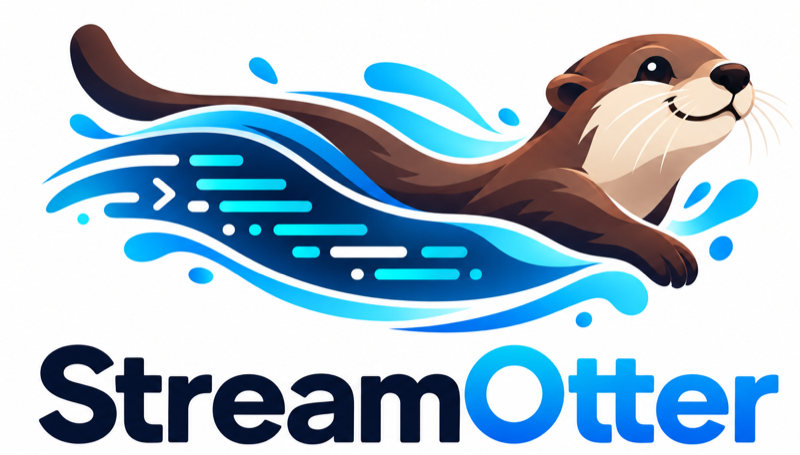

<p align="center">
  <picture>
    <source media="(prefers-color-scheme: dark)" srcset="docs/assets/streamotter-logo-dark.png">
    
  </picture>
</p>

# Lontra Creek

StreamOtter's home site and live demo. Lontra Creek is a fictional river-otter study: a simulated watershed with gauge stations, tagged otters, camera traps, and protected den sites. Its data moves through real Kafka, a real StreamOtter gateway, and the real browser SDK.

This project uses StreamOtter the way any application does: the published [`streamotter`](https://www.npmjs.com/package/streamotter) package from npm, at an exact version. It has no other connection to the [StreamOtter repository](https://github.com/jfricano/StreamOtter).

> **This branch builds against StreamOtter 0.2.0-rc.1.** `feat/v1.1-source-failure-exercises` pins `streamotter@0.2.0-rc.1` exactly, installed from the npm registry. The release was published on October 5, 2026; before that the branch used temporary pre-publish tarballs, which the registry pin replaced. See [SOURCE_FAILURE_EXERCISES.md](docs/releases/v1.1/SOURCE_FAILURE_EXERCISES.md#pre-publish-packages-and-their-removal).

The Kafka-backed path is **field station → Kafka → StreamOtter gateway → Socket.IO/WebSocket → browser SDK and UI**. The gateway also fetches current snapshots from the field station's private HTTP API. See the [data-flow diagram and walkthrough](docs/PLAN.md#kafka-data-path) for those paths and the notebook write cycle.

The browser SDK requires a running StreamOtter gateway on the server; the gateway need not be an npm dependency of the frontend project. Contracts can be used independently. See [component responsibilities and runtime requirements](docs/PLAN.md#component-responsibilities-and-runtime-requirements) for the gateway, SDK, CLI, Workbench, application-state boundary, and external-feed integrations.

> **Status: the production stack is proven in CI; not yet hosted.** The site (streamotter.dev) includes the guided field station, the Failure Lab with its Source failures track, the playground, the workbench page, reference pages, and labeled recorded fallbacks. The production stack (Kafka over TLS with SCRAM, the gateway, the field station, and Caddy, in containers) passes a full-stack test on every pull request, and `npm run dev:lab` runs it locally with three Lab benches and the workbench sandbox. Nothing is deployed. The demo will run on a shared host behind devops's TLS edge, in two phases: V1.1 on StreamOtter 0.1.0-rc.3 (#40 and #41), then a pin PR moving to 0.2.0-rc.1, published to npm on October 5. In both, the Lab benches and the sandbox stay off on the hosted demo until the owner approves them separately. See the [rollout plan](docs/releases/0.2.0-rc.1/ROLLOUT_PLAN.md), [V1.1 status](docs/releases/v1.1/STATUS.md), and [docs/PLAN.md](docs/PLAN.md).

## Layout

| Path | What it is |
| --- | --- |
| `packages/creek-sim` | The simulation: a deterministic watershed, weather, gauges, otters, and camera traps, and the channel views the field station publishes |
| `apps/field-station` | The demo application: StreamOtter configuration and handlers, the simulation runner that publishes to Kafka, the site API, and sessions |
| `apps/site` | The public site: Astro, with the live panel on the home page |
| `deploy` | The demo host: one container image, the Compose stack (Kafka, the gateway, the field station, Caddy) and its Lab, sandbox, shared-host and local overlays, its secret and certificate scripts, and the full-stack tests CI runs |
| `docs/PLAN.md` | Scope, story, architecture, operating rules, phases, and launch criteria |
| [`docs/releases/`](docs/releases/README.md) | Site release plans and notes: [V1.1](docs/releases/v1.1/README.md) (Source failures in the Lab, the actual workbench sandbox) and the [0.2.0-rc.1 rollout plan](docs/releases/0.2.0-rc.1/ROLLOUT_PLAN.md) |
| `docs/LOCAL_LAB.md` | `npm run dev:lab`: the real Lab and the workbench sandbox on your machine |
| `docs/contracts/` | The Lab, sandbox, and UI component contracts |
| `docs/SHARED_HOST_READINESS.md` | The shared-host adapter the hosted demo uses |
| `docs/DEPLOYMENT_PLAN.md`, `docs/HOSTING.md` | The original engineering plan and owner checklist, written for a standalone host; the rollout plan governs hosting now |
| `docs/TEAM_PLAN.md` | How the remaining launch work was organized: roles, process, branches, backlog, and sprints |

## Develop

Node.js 24.15 or later (the failure journal's floor; CI and the image use Node 24). Under Node 22, `npm test` cancels eight tests in `lab-coverage.test.ts`, which is the test runner, not a product failure.

```bash
npm install
npm test
npm run typecheck
npm run dev        # field station + site at http://127.0.0.1:4321
```

There are three local modes, and only the last runs the Failure Lab:

| Command | Runs | Kafka | Failure Lab |
| --- | --- | --- | --- |
| `npm run dev` | Fixture walkthrough: the simulation replayed through a development gateway, the site, and the workbench | No | No |
| `npm run dev:kafka` | The walkthrough on your own native Kafka install, with persistent notebooks | Yes (local, plaintext) | No |
| `npm run dev:lab` | The production container stack plus three Lab benches and the workbench sandbox, behind HTTPS at `https://localhost:8443` | Yes (Docker, TLS/SCRAM) | Yes |

`npm run dev` runs the field station without Kafka, replaying the simulation through a StreamOtter gateway in development mode, one study tick every two seconds, with the workbench at http://127.0.0.1:7401 (its one-time token is printed at startup).

Browser checks run with `npm run test:browser`. To verify connection loss and recovery against built production bundles using the same fixture backend:

```bash
LONTRA_BROWSER_MODE=production npm run test:browser -- e2e/home.spec.ts e2e/walkthrough.spec.ts
```

`node scripts/dev.mjs --preview` builds and serves that fixture-backed production preview for manual checks. It uses the same port variables below.

Four environment variables move the whole dev stack to a different port block, so more than one can run at once on the same machine:

| Variable | Default | What it moves |
| --- | --- | --- |
| `LONTRA_SITE_PORT` | 4321 | The Astro dev server |
| `LONTRA_GATEWAY_PORT` | 7400 | The dev gateway (also used to build its allowed origins from `LONTRA_SITE_PORT`) |
| `LONTRA_WORKBENCH_PORT` | 7401 | The StreamOtter workbench |
| `LONTRA_API_PORT` | 7402 | The field station's small site API, and the site's `/api` proxy target |

```bash
LONTRA_SITE_PORT=4331 LONTRA_GATEWAY_PORT=7430 LONTRA_WORKBENCH_PORT=7431 LONTRA_API_PORT=7432 npm run dev
```

To exercise chapter six with real Kafka and persistent private notebooks, install Kafka 4.1.2 and JDK 21 locally, then run:

```bash
KAFKA_HOME=/path/to/kafka JAVA_HOME=/path/to/jdk npm run dev:kafka
```

This command downloads nothing. It starts a loopback-only development broker, the field station, gateway, and site. It preserves Kafka logs and simulation checkpoints under `.local/kafka-dev` across normal stops/restarts. Set `LONTRA_KAFKA_DATA_DIR` to choose another directory. Besides the site/gateway/API ports above, it uses `LONTRA_INTERNAL_PORT` (7410), `LONTRA_KAFKA_PORT` (19092), and `LONTRA_KAFKA_CONTROLLER_PORT` (19093). This mode has no Failure Lab or workbench; it uses plaintext loopback Kafka and is not a production deployment. Stop with Ctrl-C; a stale `running.lock` may be removed only after confirming the prior stack has stopped.

To run the real Failure Lab locally (three benches on Kafka over TLS, the production gateway, field station, the workbench sandbox, and Caddy, in Docker), with Docker and Docker Compose 2.24.4 or later:

```bash
npm run dev:lab                    # build from source and start at https://localhost:8443/lab/ and /workbench/
npm run dev:lab -- status          # containers, plus site, health, and Lab status checks
npm run dev:lab -- stop            # stop; keeps the study, Kafka data, and secrets
npm run dev:lab -- discard         # delete the local study (asks you to confirm)
```

It keeps everything under the git-ignored `.local/lab/` (including the stack secrets and the sandbox's `SANDBOX_SERVICE_TOKEN`), publishes only `127.0.0.1:8443`, uses a throwaway test certificate it never adds to any trust store, and deploys nothing. Stopping never deletes data; only a confirmed `discard` does. See [docs/LOCAL_LAB.md](docs/LOCAL_LAB.md) for the certificate, the sandbox, the source-failure exercises, proxied networks, and the manual recipe, and [SOURCE_FAILURE_EXERCISES.md](docs/releases/v1.1/SOURCE_FAILURE_EXERCISES.md) for what each exercise shows.

In production the field station runs the simulation on the wall clock and publishes to Kafka (`apps/field-station/src/server/main.ts`), and the gateway is `streamotter start` with compiled handlers (`npm run build -w @lontra-creek/field-station`). [`deploy/compose.yaml`](deploy/compose.yaml) runs them with Kafka 4.1.2 and Caddy; [`.github/workflows/stack.yml`](.github/workflows/stack.yml) shows how to bring the stack up with throwaway secrets and test it from outside. The hosted demo is activated on the shared host (`/srv/apps/lontra`, with `/etc/apps/lontra/lontra.env`) with devops's shared-host procedure; see the [rollout plan](docs/releases/0.2.0-rc.1/ROLLOUT_PLAN.md) and [docs/SHARED_HOST_READINESS.md](docs/SHARED_HOST_READINESS.md). The `/srv/lontra` scripts and the `Deploy demo` workflow in [deploy/OPERATIONS.md](deploy/OPERATIONS.md) serve the standalone layout only.

## The simulation in brief

One tick is five study minutes; the hosted demo runs a tick every two seconds, so a study day lasts 9.6 minutes. The world is a pure function of its seed and tick and checkpoints as JSON, so a restarted field station recomputes exactly where it left off. Storm runoff routes downstream through the four gauges with travel time, so a crest reaches LC-01 first and LC-04 hours later. Otters rest through midday, come out at dawn and dusk, shelter from high water, and den in their holts. While an otter is in a den, its public channel withholds where it is.

Lontra Creek, its field station, and its otters are made up. The pipeline is real.

## License

[MIT](LICENSE) © 2026 Orca Solutions.

## Delivery workflow

See [the delivery workflow](docs/WORKFLOW.md) for author verification, focused review of high-risk changes and scoped release authority. Existing project behavior and setup commands above remain authoritative.
