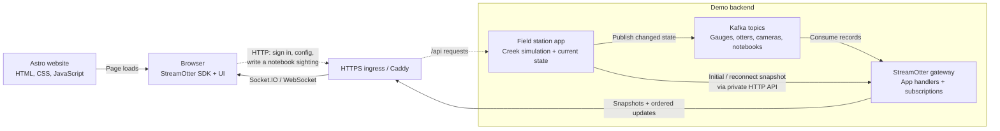

# Lontra Creek: the StreamOtter site and live demo

September 26, 2026 · Phase 0 done; Phase 2 in progress (the production stack is proven in CI, not yet hosted) · Domain: `streamotter.dev` · Visual blueprint: [StreamOtter Site Blueprint](https://claude.ai/artifact/6Zfj7bgjuXaSShKDQ5LJuv)

**September 27 implementation update:** the complete site and leased Failure Lab
are under integration review in [PR #20](https://github.com/jfricano/lontra-creek/pull/20).
Use [WORKING_RECORD.md](WORKING_RECORD.md) for current evidence and
[SHARED_HOST_READINESS.md](SHARED_HOST_READINESS.md) for the shared-host constraints.
The phase descriptions below preserve the agreed scope; they are not a claim of
public deployment. Hosted timing/capacity, staging acceptance, cloud/account setup,
Kafka topic confinement disposition, and launch approval remain outstanding.

**October 4, 2026 update:** V1.1 is built, not deployed. Draft PR #40 (with #41's
move to streamotter.dev) runs on StreamOtter 0.1.0-rc.3; the phase 2 branch adds
the workbench sandbox and the source-failure exercises on 0.2.0-rc.1, which is
not on npm yet ([V1.1 status](releases/v1.1/STATUS.md)). Hosting changed: the demo
will run on a shared ARM host behind devops's shared TLS edge, not a dedicated VM
(see [Architecture and hosting](#architecture-and-hosting)). The
[rollout plan](releases/0.2.0-rc.1/ROLLOUT_PLAN.md) governs the deployment, in two
phases; in both, the Lab benches and the workbench sandbox stay off on the hosted
demo until the owner approves them separately.

This repository holds StreamOtter's public home site and its live demo. The demo is a fictional river-otter study at Lontra Creek whose data moves through real Kafka, a real StreamOtter gateway, and the real browser SDK. The site's job is to take a developer from "what is this" to "I watched it survive a failure" to `npm install streamotter` in one visit.

This document owns the site's scope, the demo's behavior and operating rules, and the launch criteria. StreamOtter's own behavior is defined by the library, not here. [DEPLOYMENT_PLAN.md](DEPLOYMENT_PLAN.md) holds the engineering steps to launch, and [HOSTING.md](HOSTING.md) the owner's account checklist.

## Future site releases

The [site release index](releases/README.md) and [V1.1 plan](releases/v1.1/README.md) own future site/demo work. The former V1.5 milestone is now V1.1. It adds Source failures inside `/lab/` and replaces the existing `/workbench/` tour with the actual published workbench sandbox, without another route or navigation item. `/playground/` remains the quick validator. Both are built (the sandbox and the exercises on the phase 2 branch, against a pre-publish StreamOtter 0.2.0-rc.1) and run under `npm run dev:lab`; neither is deployed, and neither runs on the hosted demo until the owner approves it. The route table and operating rules below describe the baseline until launch checks pass. Implementation progress is tracked in [V1.1 status](releases/v1.1/STATUS.md).

Library policies, native acceptance, and package publication stay in StreamOtter's `docs/releases/v1.1/`; Lontra Creek owns visitor sessions, synthetic integration, site acceptance, and deployment. Their release decisions remain independent.

## Ground rules

**Independent of the library repository.** This repository uses StreamOtter only as a published npm package, at an exact version, installed with npm the way any developer would. It never links to the library's source: no git submodules, workspace links, local paths, or checkouts, including for tests and docs. A problem the demo finds becomes an issue on the library, and this repository upgrades after a release ships (release candidates count). The one shared asset is the logo: copies of its source files in `assets/`.

**Every claim matches the pinned release.** Behavior, code samples, screenshots, and limits describe the version in `package.json`. No invented adoption counts, testimonials, capacity claims, or performance numbers. A number says where it was measured. Future plans stay visibly separate from shipped features.

**Fiction is labeled.** Lontra Creek, its field station, its people, and its otters are made up. The pipeline is real. Any page that could blur the two says which is which. A recording is labeled as a recording, and the site never silently substitutes an animation for the live demo.

**Visitors can't hurt each other or the host.** Visitors can't upload code, choose topics, send arbitrary payloads, connect their own broker, or reach the broker, the stores, management APIs, or the workbench. Scenario actions are a fixed set. Failure scenarios run only on isolated, leased benches (see the Failure Lab).

## The story

Lontra Creek is a 14.2 km watershed from Alder Spring to the Marrow River, named for *Lontra canadensis*, the North American river otter. A field station monitors it:

| Instrument | IDs | Reports |
| --- | --- | --- |
| Gauge stations | LC-01 Cedar Riffle, LC-02 Kestrel Bend, LC-03 Slate Canyon, LC-04 Heron Marsh | Stage (ft), flow (cfs), water temperature (°C), dissolved oxygen (mg/L), turbidity (NTU) |
| Telemetry receivers | One per reach | Detections of tagged otters |
| Camera traps | Cedar Riffle, Beaver Flats, Heron Marsh | Frames: species, count, time |
| Holt monitors | Holt A (Beaver Flats), Holt B (Heron Marsh) | Den occupancy and exact grid reference |

The cast: **Pebble** (LO-07, adult female, home range Kestrel Bend to Slate Canyon, dens at Holt A with her pups), **Sprout and Skipper** (untagged pups, seen only on camera traps), **Birch** (LO-03, adult male, ranges the whole creek), and **Juniper** (LO-11, yearling female, dispersing downstream and sometimes leaving the watershed).

Den sites are restricted to researchers, as real studies restrict them to prevent disturbance. The public otter channel withholds an otter's location while it is at a den; only the restricted holt channel has the grid reference. That split follows StreamOtter's rule that every reader of one channel instance receives the same public state, so different audiences get different channels.

## Pages

| Route | Visitor's question | Content |
| --- | --- | --- |
| `/` | Why would I use this? | The live creek hero on a real subscription (a labeled recording when the demo is down), three-step integration with type-checked code, the live-or-stale promise, a workbench preview, Get started and Try the demo. |
| `/field-station` | What does it look like running? | The guided walkthrough (below), the creek map, and an under-the-hood panel: states, epochs, revisions, and the code behind each step. |
| `/lab` | What happens when it breaks? | The Failure Lab (below). |
| `/playground` | What's it like to set up? | Edit a `streamotter.json` with the real validator running in the browser; generated types once the library can generate in a browser; and a labeled console that subscribes to the field station. |
| `/workbench` | What tools do I get? | A tour of Connect, Define, Preview, Inspect, and Export from screenshots Playwright captures from the workbench installed from npm. |
| `/when-it-breaks` | How does it fail, exactly? | Each failure mode: the state it produces, the `StreamError` the application receives, whether it retries, handling code, and an interactive state diagram. |
| `/docs` | How do I build with it? | A map of the documentation linking to the guides on GitHub and the package pages on npm. The site doesn't copy them. |
| `/releases` | What works in this version? | The pinned version, its verified support matrix and limits as published by the library, and links to its changelog. |

## The guided walkthrough (`/field-station`)

About three minutes, validated by a timed walkthrough before launch. Visitors start as a volunteer with an anonymous, short-lived session.

1. **Dawn survey.** Open the Kestrel Bend gauge: authorizing, synchronizing, snapshot, live.
2. **The creek rises.** Readings arrive as full states with increasing revisions. Storms follow the simulation's schedule; this chapter points at whichever station is changing fastest.
3. **Into Slate Canyon.** The visitor's own connection drops. Views turn stale while the creek keeps moving. Reconnecting brings fresh snapshots and a note listing the revisions that were not replayed.
4. **The protected holt.** As a volunteer, subscribe to Holt A. The gateway answers `FORBIDDEN` and sends no data.
5. **Hand over the tablet.** Sign in as the field biologist (a different subject). Existing subscriptions close with `UNAUTHENTICATED`; the new identity subscribes fresh and Holt A opens.
6. **Log a sighting.** The app writes the visitor's notebook, publishes it to Kafka, and the visitor's notebook view updates through the gateway.

## The Failure Lab (`/lab`)

The Lab ships with the launch. It uses a fixed pool of three benches, not one per visitor. Each bench has its own gateway process and project, its own copy of the creek's topics, and its own consumer group, is leased to one visitor for five minutes, and is reset between leases. When every bench is busy, the page shows the visitor's place in line and the local-run instructions.

| Scenario | What the visitor does | What they see |
| --- | --- | --- |
| Fouled sensor | Remove LC-03's calibration table; the bench's map handler throws on the next reading. | The source pauses at that record, views go stale, and the trace shows `map` failing with `HANDLER_FAILED`. After restoring the table and resuming, the same record is processed; nothing is skipped. |
| Flash flood takes the relay | Cut the network path between the bench gateway and Kafka. | Stale after the inactivity window, then live again soon after the path is restored. Timings shown are measured on this deployment. |
| Laptop on a satellite link | A simulated client on the bench stops acknowledging frames. | That client is disconnected after the receipt timeout; the visitor's view keeps flowing and the source never waits. |
| Relay restart | Restart the bench gateway. | Reconnecting, fresh snapshot, live. |

Benches run StreamOtter's gateway in development mode so their traces can be read, each with a project of its own, since V1 supports one gateway per project. They start it from the Lab's own entry point with `createGateway({ mode: "development" })` rather than `streamotter dev`. The CLI prints a new management token to the logs on every start, serves the workbench, and needs a configuration file per bench and a compiled handler module. The entry point instead builds each bench's project from its number, starts the management API on the bench's loopback interface with a token it keeps in memory and no workbench, registers no development principals, and can host the bench's own API in the same process. The field station app reads traces through that API and exposes a redacted feed. The demo host's gateway runs `streamotter start` in production mode.

Each bench reaches Kafka only through a proxy of its own, which the flash flood cuts. Its feed, a copy of the creek that the field station publishes to the bench's topics, never crosses that path. The mechanism is proven in CI on amd64 and arm64 ([DEPLOYMENT_PLAN.md](DEPLOYMENT_PLAN.md), workstream 6).

## Architecture and hosting

> **October 4, 2026: hosting changed.** The demo backend will run on a shared ARM host beside other apps (iYosi and Roost), behind devops's shared TLS edge, as the private Compose project described in [SHARED_HOST_READINESS.md](SHARED_HOST_READINESS.md): Caddy is a private router on the edge network, the edge owns TLS and port 443, and no service publishes a host port. Releases live under `/srv/apps/lontra` and are activated by an operator with devops's shared-host procedure; no workflow deploys the backend (GitHub Actions only builds the image). The [rollout plan](releases/0.2.0-rc.1/ROLLOUT_PLAN.md) governs. The VM sizing, budget rules and cost below were written for a host Lontra Creek had to itself (the standalone layout); the shared host's capacity, monitoring and budget belong to its owners. The routes, the Kafka setup and the static site on Cloudflare still hold.

The whole stack runs on free tiers. The only fixed cost is the domain.

```
visitor ─HTTPS─▶ Cloudflare (free plan): DNS for streamotter.dev, the static site, and a proxy in front of the demo host
                   │
                   └─HTTPS/WSS─▶ demo host: one Oracle Cloud Always Free Ampere A1 VM (2 OCPUs, 12 GB), Docker Compose
                                   Caddy (TLS, rate limits, port 443 only)
                                     ├─ /streamotter/*  ─▶ gateway: `streamotter start`, production mode, from npm
                                     ├─ /api/*          ─▶ field station app: sessions, scenarios, simulation, snapshot API
                                     └─ /lab/*          ─▶ Failure Lab benches (dev-mode gateways)
                                   Kafka 4.1.2, KRaft single node, TLS + SCRAM-SHA-512, private
GitHub Actions: builds arm64 images and deploys over SSH; no Docker needed on a laptop
```

- **One gateway** is StreamOtter V1's supported topology, so the demo runs what its docs recommend, behind Caddy.
- **Kafka 4.1.2** is the broker version StreamOtter's Kafka tests use, with TLS and SCRAM as in its production check. Managed Kafka free tiers are small, and managed services are outside StreamOtter's verified matrix.
- **Oracle Cloud's Always Free tier** is the only free option large enough for a JVM broker plus several Node processes: Ampere A1 with 2 OCPUs and 12 GB of memory, 200 GB of block storage, and 10 TB of monthly egress. Oracle halved the A1 allowance on June 15, 2026 without announcing it, so the design stays portable: plain Docker Compose and Caddy, which move to any Linux host by redeploying.
- **Cloudflare** registers `streamotter.dev` at cost, serves the static site, and proxies the demo host with WebSockets on its free plan. The static site deploys separately, so pages, the docs map, and the playground stay up when the demo host is down. Live panels then show an unavailable state, a labeled recording, and local-run instructions.

### Budget protection

- Keep the instance from counting as idle. Oracle may reclaim an Always Free instance whose CPU, network, and memory all stay under 20% for a week; its documentation doesn't say whether that spares paid accounts. The stack holds well over 20% of memory (2.4 GB) by design: the broker runs with a fixed, pre-touched 3 GB heap, and the gateways, app, and benches add to it. Measured in CI: 3.36 GiB for the whole stack with the 3 GB heap (28% of 12 GB before the operating system), against 2.35 GiB with a 2 GB heap, which was too close. The host's monitoring records memory use, and an alert fires if it drops under 25%.
- Upgrade the Oracle account to Pay As You Go. Always Free resources stay free, the account can't fall back to reduced Free Tier treatment, and community reports say paid accounts aren't reclaimed. That is not official, so the memory rule above still applies.
- Create an Oracle budget with an alert at $1 of actual spend. Any charge at all means something outside Always Free was created. A budget alarm notifies; it doesn't stop spending.
- Use only Always Free shapes and storage, recorded in the infrastructure code.
- Cloudflare's and GitHub's free plans have no usage charges. GitHub Actions minutes are free for public repositories; a private repository gets 2,000 minutes a month with a $0 spending limit by default.
- Fallback if Oracle stops working out: the same Compose stack on an AWS t4g.medium at about $33–42 a month.

## Data flow and consistency

### Kafka data path

This diagram shows the main demo's Kafka-backed data path. HTTPS proxy layers are simplified; it does not describe the separate Failure Lab benches or the planned Workbench sandbox. The local `npm run dev` fixture mode bypasses Kafka.



Solid arrows show page or state delivery; dotted arrows show browser HTTP requests. The snapshot arrow carries the response to a request initiated by the gateway; the Kafka consumer runs inside that gateway.

1. **Generate and publish.** The simulated field station is part of Lontra Creek's backend. It prepares each channel's current state before publishing a record containing that full state and its revision. Its producer connects directly to Kafka using broker configuration and credentials; an HTTP API call does not establish the Kafka connection.
2. **Map and deliver.** The gateway consumes Kafka records. Application handlers select the appropriate channel and return its state, parameters, and revision; StreamOtter validates it and delivers ordered updates to authorized subscriptions. The gateway does not reconstruct creek state from raw sensor events in this demo.
3. **Subscribe and recover.** On initial subscription or reconnect, the gateway's snapshot handler requests the current view from the field station's private HTTP API using a service token. StreamOtter synchronizes the subscription with that snapshot and continuing updates.
4. **Render in the browser.** The SDK runs inside the browser alongside our frontend code. It receives snapshots and updates over Socket.IO/WebSocket, and the UI updates its cards. The browser never connects to Kafka.
5. **Write a sighting.** The browser sends a separate authenticated HTTP request through Caddy to the field station. The app updates the visitor's notebook, then publishes its state to Kafka; the gateway delivers it back to the notebook's authorized subscriber.

The demo's Compose topology places the field station, Kafka, and gateway in separate services on one server. Sharing that host is a deployment choice, not a requirement to colocate a data source with StreamOtter. Several browser clients can subscribe to the same gateway; application code owns the UI, accepted identities, and allowed origins. Lontra Creek is one application built with the published package, not a frontend other applications must use.

Implementation: the [station runner](../apps/field-station/src/server/station.ts) writes current views before publishing; the [Kafka producer](../apps/field-station/src/server/kafka.ts) sends records; the [gateway handlers](../apps/field-station/src/kafka-handlers.ts) map records and fetch snapshots; the [browser client](../apps/site/src/scripts/field-client.ts) creates subscriptions; and the [site API](../apps/field-station/src/server/http.ts) handles notebook writes.

### Component responsibilities and runtime requirements

StreamOtter provides the synchronization and delivery layer for application-owned state. The application defines channel schemas, authentication and authorization rules, record-to-state mapping, and authoritative snapshots. If raw events need aggregation into business state, that remains application logic. In Lontra Creek, the field station already prepares complete views before publishing them.

| Component | Runs where | Responsibility |
| --- | --- | --- |
| [Gateway](https://www.npmjs.com/package/@streamotter/gateway) | Server-side Node.js | Consumes Kafka, runs application handlers, validates state, enforces access, coordinates snapshots and revision-ordered updates, bounds queues, and sends Socket.IO messages. |
| [Browser SDK](https://www.npmjs.com/package/@streamotter/client) | Inside the browser | Implements the receiving protocol: subscriptions, frame receipts, connection recovery, resynchronization, and explicit live/stale states. Application code renders the data in its own UI. |
| [CLI](https://www.npmjs.com/package/@streamotter/cli) | Developer or server environment | Scaffolds projects, validates configuration, generates types, and starts development or production gateways. Data delivery runs in the gateway it starts, rather than in a separate CLI processing stage. |
| [Workbench](https://www.npmjs.com/package/@streamotter/workbench) | Local development | Provides configuration, preview, and inspection tooling. Production browser subscriptions do not require the development Workbench. |
| [Contracts](https://www.npmjs.com/package/@streamotter/contracts) | Browsers, Node.js, or tooling | Supplies shared types, protocol constants, and validation. It can be used independently without a running gateway or Kafka connection. |

**The SDK requires a compatible StreamOtter gateway running server-side for live subscriptions.** This is a deployment requirement across the network, not an npm dependency or peer dependency on the gateway package. The SDK implements StreamOtter's protocol; it does not connect directly to Kafka or work with an arbitrary WebSocket or Socket.IO server. A frontend can install `@streamotter/client` alone while the gateway runs in a separate backend project. The all-in-one `streamotter` package is an optional installation that includes both browser and server components.

The SDK's package dependencies are `@streamotter/contracts` and `socket.io-client`; the gateway also depends on contracts, and the CLI already depends on the gateway. Contracts does not depend on either runtime. Installing the gateway package in a frontend project would not establish the network service the SDK needs.

The gateway can run as its own service or inside an existing Node.js backend process through `createGateway`. StreamOtter V1 supports one gateway instance per project, serving multiple authorized clients; each frontend's origin must be explicitly allowed. This does not require a particular frontend framework, a single UI, or colocation with Kafka or the data source. See the library's [existing-application guide](https://github.com/jfricano/StreamOtter/blob/main/docs/guides/existing-app.md) and [deployment guide](https://github.com/jfricano/StreamOtter/blob/main/docs/DEPLOYMENT.md) for the supported integration and topology.

Another application may consume an outside provider's Kafka feed and use its own gateway to deliver state to customer frontends: **outside Kafka provider → application-owned StreamOtter gateway → customer SDK and UI**. The gateway is itself the consumer; the application supplies mapping, access rules, and a current snapshot source. If the provider supplies only events, the application must maintain or obtain authoritative current state. StreamOtter does not automatically create that store. Consumers choosing other Kafka tools can read the feed independently using their own consumer groups; the SDK is required for StreamOtter's browser delivery, not for consuming Kafka generally.

### Consistency rules

The simulation (`packages/creek-sim`) is deterministic: the world is a pure function of its seed and tick. The field station app is the only writer. There is no separate database.

- **Ticks and time.** One tick is five simulated minutes. In the hosted demo a tick happens every two real seconds, so a simulated day lasts 9.6 minutes. The target tick comes from the wall clock, so a restarted app computes the same world and continues where it should be.
- **Revisions.** A shared-world entity's revision is `generation × 10¹² + tick`, where tick is when it last changed. The generation increases whenever the simulation's logic changes or the world is reset, so revisions only move forward even when a new version recomputes history differently. Without that, a replayed tick with different data would be a `REVISION_CONFLICT` and pause the source.
- **Write, then publish.** Each tick, the app updates the state its snapshot API serves, then publishes the changed entities to Kafka, keyed by entity ID so each one stays on one partition. A snapshot is therefore never older than anything already published. After a crash, the app republishes the current state of every entity; equal revisions with equal data are dropped as duplicates. A catch-up after downtime publishes only the latest state, which is correct for full-state channels.
- **Snapshots.** The gateway's snapshot handler reads the app's internal snapshot API with a service token.
- **Checkpoints.** The app writes a world checkpoint to local disk hourly, so a restart replays at most an hour of ticks.
- **Sessions** are signed badges with expiry, so the server keeps no session table.
- **Notebooks** live in the app's memory and in a compacted Kafka topic, `field.notebooks`, which keeps the latest record for each key. On startup the app rebuilds them from that topic. A notebook's revision is the write time in milliseconds, kept strictly increasing, so a restart can never reuse a revision for different data. Notebooks expire with their session: each is published once more as expired and empty (StreamOtter V1 pauses a source on a tombstone), and the topic's delete retention, two hours, removes old records.

Channels: `station` (stationId), `otter` (otterId), `reach` (reachId, camera traps), `holt` (holtId, researchers only), `creekOverview` (watershed), and `notebook` (observerId, its owner only). Topics: `field.gauges`, `field.telemetry`, `field.cameras`, `field.holts`, `creek.overview`, and `field.notebooks`, in two sources so a notebook problem can't pause the world.

## Limits and operations

Record these on the real host before launch: concurrent visitors (start at 300), subscriptions per visitor (12), scenario actions (one per second), session lifetime (30 minutes), idle expiry (10 minutes), Kafka retention, and gateway queue limits. Two sessions must not be able to read or affect each other's notebook. Keep deployment, rollback, health checks, and the budget alarm with the infrastructure code. The operator is the repository owner.

Cost: $0 a month on the free tiers above, plus $14.20 a year for `streamotter.dev`.

## Phases

| Phase | Delivers | Needs |
| --- | --- | --- |
| 0. Foundation | This repository, the plan, the creek simulation with tests, the field station's StreamOtter project validated and exercised with the published package, design tokens, and the site scaffold. | Nothing further. |
| 1. Static site | Home with a recorded hero, When it breaks, Workbench tour, Playground validator, the docs map, Releases. Deployable on its own. | `streamotter.dev` registered; a Cloudflare account. |
| 2. Field station | Production gateway, app, simulation runner, notebooks; the six chapters; containers; staging on the demo host. | An Oracle Cloud account on Pay As You Go, with the budget alarm; local Kafka. |
| 3. Failure Lab | Bench pool, relay-cut proxy, slow client, redacted trace feed. Ships with the launch. | Nothing further. |
| 4. Launch | The criteria below, then publication. | Owner's go-ahead. |

## Launch criteria

- Every route and call to action works; install commands and code samples are checked against the pinned `streamotter` version.
- The hosted walkthrough and the Failure Lab pass on the real deployment, including session isolation, expiry, cleanup, denial, reconnect, bench leasing, and the busy and unavailable states.
- Keyboard navigation, visible focus, readable contrast, screen-reader labels, reduced motion, and narrow screens work on every page. Supported browsers are named and checked.
- Titles, descriptions, social previews, a sitemap, canonical URLs, and a useful not-found page exist. Page load and demo startup are measured on a named device and network profile.
- HTTPS, WebSocket connectivity through the proxy, secrets handling, quotas, health monitoring, rollback, the budget alarm, and the fallback recording are verified on staging. Operating limits and the operator are recorded here.

After launch, the planned [V1.1 companion](./releases/v1.1/README.md) adds Source failures and the existing Workbench page's sandbox replacement once an exact published StreamOtter release supplies the required capabilities. It is not a claim about current availability or a retroactive launch criterion.

## Open decisions

- ~~Confirm the hosting above (Oracle Cloud Always Free and Cloudflare), or choose the AWS fallback.~~ Settled: a shared host behind devops's edge, and Cloudflare for DNS and the static site (see the note under Architecture and hosting).
- Whether this repository is public on GitHub, and when it is first pushed.
